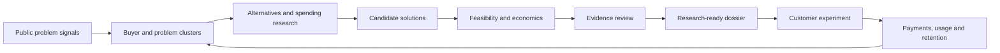

# Discover: researched opportunities, demand tests and revenue models

Design proposal · 2026-09-26 · repository inspected at `497b90c`

Implementation direction confirmed by owner: keep existing Discover intact and create an independent **Opportunities** workspace alongside it. The new workspace reuses read-only research collectors and explicitly imports copies of selected legacy ideas; changes described below apply to the new engine, not legacy Discover behavior.

## Implemented companion workspace

The first implementation adds a separate Opportunities view, SQLite dossiers and history, three
exploration modes across 13 industries, explicit public/deep research, evidence freshness and review
gates, deterministic economics and sensitivity, revenue-model recommendations, and planned buyer
experiments with immutable owner-attested results. Import creates copies; it does not migrate or
rewrite Discover. The [README](../README.md#opportunities) documents behavior and isolated preview use.

This document remains the broader design rationale. Automated market sizing, statistical demand
probabilities, payment-provider verification, portfolio budget allocation and automatic multistep
research of every generated idea are not part of this implementation. Generation creates hypotheses;
research must be explicitly requested and reviewed. Real payment and repeat-use evidence must be
collected through actual experiments.

## Product promise

Discover should deliver a short, diverse list of opportunities with the homework attached: a specific buyer and problem, original evidence, alternatives, a proposed product, executable economics, a recommended way to charge, and the next experiment that could change the decision.

This proposal assumes a balanced mix of early cash flow, recurring revenue and novel product bets. Markets should extend beyond the owner's existing audiences. Geography, language, available hours, cash budget and desired revenue remain explicit filters; they must not silently become demand assumptions.

Research can establish documented pain, existing expenditure and a plausible opening. Evidence of buyers purchasing and returning must come from real transactions and use. A novel product starts with a testable hypothesis, even when its underlying problem is well established. Strategyzer distinguishes exploratory statements from behavioral validation; NSF I-Corps likewise centers direct customer discovery. [1][2]

## What the current implementation does

The foundations are useful: an inventory, public-source Leads collection, streaming generation, saved ideas and an archive. The gaps are structural:

| Current behavior | Consequence | Proposed change |
| --- | --- | --- |
| `src/mix.ts:319` invokes generation with no tools; `src/feed.ts` supplies the inventory and prompt | The generation path cannot independently verify live demand or competitors | Add a separate retrieval and evidence stage before research-ready promotion |
| `src/studio-prompts.ts:7` hardcodes audiences and market claims | Past interests and uncited demand assumptions shape every idea | Keep owner preferences separate from dated, source-backed market observations |
| `src/studio.ts:207` checks field presence, lengths and inventory count | A well-filled pitch can pass without supporting evidence | Retain a schema-completeness check; add distinct research and validation gates |
| `src/studio-prompts.ts:64` asks a model to predict paying customers from a short pitch | A subjective score looks like commercial validation | Have the reviewer identify unsupported claims, contradictions and missing tests |
| `src/feed.ts:19` treats identical ingredient sets as duplicates | Different businesses using the same stack can be removed | Compare buyer, job, outcome and product mechanism; keep stack similarity separate |
| Builds require at least two existing inventory items | Unrelated opportunities are forced into existing projects | In open-market mode, generate from problems first; assess available capabilities later |
| Price, cost and time-to-first-dollar are prose strings | Financial conclusions cannot be recalculated or audited | Store typed assumptions, formulas, units, currency and provenance |
| Leads ranks pain phrases, engagement and recency | Popular complaints can appear commercially strong without a buyer | Preserve these as discovery signals; require separate payer, budget and behavior evidence |

These observations describe the inspected paths, not an assessment of every feature in the repository. `src/idea-archive.ts` already provides a persistent SQLite foundation; preserve saved ideas and their identities.

## Discovery beyond existing interests

Use independent facets rather than mixing industries, revenue models and build speed in one category list.

**Industry:** construction and trades; property operations; logistics and field service; manufacturing and quality workflows; retail and returns; hospitality and events; adult education and training; creator operations; professional-service administration; household coordination; accessibility and language workflows; developer infrastructure. These are exploration categories, not claims of validated demand.

**Problem:** lost revenue; repeated labor; coordination failure; rework; slow handoffs; inaccessible information; uncertainty before a decision; difficult purchasing; unwanted administration.

**Revenue:** paid service; subscription; usage; one-time sale; license/API; transaction fee; sponsorship/affiliate.

**Evidence:** concept; research-ready; buying signal; paid pilot; repeat use/renewal.

**Exploration mode:**

- Use my advantages: current projects, skills and audiences influence candidate generation.
- New markets: buyers and problems are selected independently of the project portfolio. Inventory is introduced only during feasibility assessment.
- Novel solutions: propose a new mechanism for an evidenced problem, including mechanisms transferred from another industry.

A starting feed policy could allocate 30% of research slots to existing advantages, 40% to new markets and 30% to novel solutions. These are adjustable product settings, not empirically optimal weights. Limit domination by any one industry or buyer segment. If a lane lacks sufficient evidence, show the gap instead of manufacturing research-ready cards to fill a quota. A shortfall can remain an unresearched candidate queue.

Track concept diversity using buyer/job/mechanism coverage, with a regression fixture in which two opportunities share an identical stack but serve different customers. Existing interests may improve feasibility ranking but must not veto an unrelated market.

## Evidence pipeline and the homework package



The pipeline should research both supporting and disconfirming evidence. Search for existing solutions, satisfied users, abandoned products, low willingness to switch, data-access obstacles and acquisition difficulties. A skeptic reading the same unsupported pitch is insufficient; contradictory evidence must be retrievable too.

Every promoted dossier contains:

1. **Buyer and job:** end user, budget owner, situation that triggers a purchase, frequency, geography and language.
2. **Problem evidence:** original sources, dated excerpts or locators, independent source groups, recurrence and observable consequences. Reposts and articles about the same underlying event count as one group.
3. **Current expenditure:** what customers pay or do today, source and segment fit; monetary costs and time costs shown separately. A competitor's list price establishes an available offer, not realized sales.
4. **Alternatives:** the nearest direct products, manual workaround, service providers and doing nothing; pricing, workflow coverage, strengths and switching costs. Search broader terminology and adjacent industries.
5. **Proposed opening:** exact underserved workflow, how the solution changes it, why that matters and what remains speculative.
6. **Feasibility:** essential data/API access, licensing, integrations, implementation unknowns, operating workload and critical technical experiment. Inventory reuse is an advantage, not a demand signal.
7. **Distribution:** concrete places to reach this segment, source-backed channel availability, permitted use, sales cycle and a plausible acquisition funnel. Membership in a community is not a count of reachable buyers.
8. **Economics:** scenario model and sensitivity results; assumptions connected to evidence or clearly marked unknown.
9. **Revenue recommendation:** primary model, optional complementary stream, buyer, charging unit, price-test range, delivery costs and reason for the recommendation.
10. **Decision and next test:** strongest case, strongest objection, largest uncertainty, next experiment, pass/fail/indeterminate criteria and a capped cost/time budget.

Market research should cover demand, pricing, reach and direct and indirect competition, consistent with the SBA's research framework. [3] Search trend indices can help track attention, but Google Trends normalizes its values to 0–100; they must never become search volume, buyer counts or purchase intent in the model. [4]

### Evidence record

Keep source and claim records distinct:

- Source: canonical URL, publisher, publication date when known, retrieval date, language, geography, source type, excerpt/locator, content hash, independence group and access state.
- Claim: a small specific statement, buyer/job scope, supporting and opposing source IDs, status (`observed`, `inferred`, `assumed`, `unknown`, `contradicted`), review notes and freshness rule.
- A model suggestion or generated quote cannot create an observed claim. Links must actually be opened and checked for claim support. Missing data stays missing.
- Preserve source failures and coverage gaps. A failed search cannot become a statement that no alternative exists.

Refresh according to claim type: product price/API access generally needs a fresher check than a stable workflow description. Recompute dependent economics and promotion status when key evidence changes. Dates alone do not make evidence representative.

### Promotion stages

| Stage | Meaning |
| --- | --- |
| Concept | A specific product hypothesis; evidence can be incomplete |
| Research-ready | Buyer/problem, alternatives, access, distribution and economics have been investigated; material gaps are visible |
| Buying signal | A target buyer took a concrete action under known offer terms; record whether it was a meeting, trial, letter of intent or deposit |
| Paid pilot | Actual target customers paid; record amount, discounts, refund terms, delivery cost and outcome |
| Repeat use / renewal | Cohort evidence of returning use and renewed or repeated payment over a stated observation window |

Do not collapse these into a single “proven” badge. A deposit supports one buying decision; it does not establish retention. A waitlist supports interest; it does not establish willingness to pay. Interviews must distinguish users from buyers. [1][2]

Research-ready requires coverage of every material dimension, not an arbitrary source count. A configurable operational minimum of independent customer evidence can help avoid single-post ideas, but must be described as a screening policy. Paid pilots and renewal thresholds should be set for the particular market, sample size and sales cycle before an experiment begins.

## Novel solutions with a clear demand thesis

Measure **problem evidence**, **solution novelty** and **product validation** independently.

Generate from observed jobs using concrete transformations: eliminate a handoff; prevent an error earlier; combine currently disconnected stages; transfer a working mechanism from another industry; serve an excluded segment; make an episodic purchase possible without a subscription; enable a formerly uneconomic workflow with a newly available capability.

For each proposed novelty, record closest alternatives, exact difference, what changed to make it feasible, and the customer experiment that could distinguish it from existing options. The correct search conclusion is “no close match found within this recorded search scope as of this date.” A global claim of nonexistence cannot be established by a finite search.

An illustrative research question for an unrelated category: can small field-service teams turn scattered job photos and messages into a customer-ready completion packet with materially less administration? This is an unvalidated example of a job to investigate, not a claim that the product is new or that buyers want it. First inspect existing field-service products, actual workflow complaints, current labor and a buyer's response to a delivered sample.

Keep promising novel concepts visible even before validation; label them correctly and rank their next experiment by how much uncertainty it can resolve for its cost.

## Economics computed from explicit inputs

Every input carries a unit, period, currency, low/base/high scenario values, source or assumption note, observation date and confidence basis. Unknown conversion, CAC or retention must not be filled with an unexplained industry average. Model outputs are conditional scenarios until measurements exist.

Use a deterministic calculation module, not model-written arithmetic. A simple recurring model begins with:

```text
monthly contribution/customer = realized monthly price − variable delivery cost/customer
new customers = qualified reachable prospects × response rate × qualified rate × close rate
customers[t] = customers[t−1] × (1 − monthly logo churn) + new customers[t]
monthly revenue[t] = customers[t] × realized monthly price
monthly operating surplus[t] = revenue[t] − variable delivery costs[t]
                               − fixed operating costs[t] − acquisition costs[t]
CAC = attributable sales and marketing costs / new paying customers
simple contribution payback months = CAC / monthly contribution/customer
```

The revenue formula above uses an explicit end-of-month/billed-customer convention; a production cash model should track cohort start dates and actual billing. Keep annual prepayments, bookings, recognized revenue and cash receipts separate. One-time setup charges are not recurring revenue.

Delivery cost includes AI/API use, retries, hosting, payment fees, refunds, onboarding and support where attributable. Present cash expenses and the economic cost of founder time separately. Avoid charging the same labor twice. State whether taxes and financing are included; compare currencies only with a dated conversion input.

For rough constant-churn planning, a finite cohort is safer than an unbounded lifetime:

```text
H-month cohort contribution/customer = Σ[m=0..H−1] contribution × (1−churn)^m
H-month cohort contribution after acquisition = that sum − CAC
```

This assumes constant contribution and churn, no expansion and full first-period payment. It is not a probability of success, and does not include allocated fixed costs. Payback calculated as CAC/contribution ignores churn; also show whether the finite cohort contribution actually recovers CAC. Treat zero or negative contribution, zero customers and nonpositive acquisition denominators explicitly. Stripe's CAC/payback guidance supports connecting acquisition cost to ongoing customer contribution and retention. [5]

Add a capacity constraint: available delivery/support hours must cover modeled customer volume, including founder sales time. Estimate obtainable revenue from reachable buyers, conversion, retention and service capacity; market population is context, not a revenue forecast.

For each opportunity expose a 12-month cash model, startup/research/build costs, cash needed before break-even and sensitivity to the two or three inputs that matter most. Sensitivity should vary one input at a time as well as showing coherent multi-input scenarios. Scenarios are not statistical confidence intervals.

### Checked arithmetic example — entirely assumed, not a market forecast

All prices, costs, conversion economics and customer counts below are illustrative assumptions. Currency is USD. The example models a steady active customer base, with same-period acquisition replacing churn. Fixed monthly costs are $300 cash overhead plus $1,000 of founder operating time. The per-customer delivery costs include support labor and exclude that fixed operating time.

| Monthly input/output | Downside | Base | Upside |
| --- | ---: | ---: | ---: |
| Active paying customers | 20 | 50 | 100 |
| Price/customer | $99 | $99 | $99 |
| Delivery cost/customer | $40 | $25 | $18 |
| CAC | $450 | $240 | $150 |
| Monthly logo churn | 8% | 4% | 2% |
| Revenue | $1,980 | $4,950 | $9,900 |
| Contribution/customer | $59 | $74 | $81 |
| Cost of replacing churned customers | $720 | $480 | $300 |
| Surplus after fixed costs, founder time and replacement acquisition | **−$840** | **$1,920** | **$6,500** |
| Steady-state break-even customers | 57 | 21 | 17 |
| Simple contribution payback, before churn | 7.63 months | 3.24 months | 1.85 months |
| 12-month cohort contribution after CAC, before fixed overhead | $16.35 | $476.49 | $721.90 |

For the base case: `$4,950 − 50×$25 − $300 − $1,000 − 50×4%×$240 = $1,920`.

Steady-state break-even is `ceil(fixed costs / (contribution/customer − churn×CAC))`, if the denominator is positive. This excludes growth acquisition, startup costs, tax and financing. The cost of first acquiring the existing 50 customers is a separate cash requirement; at the assumed $240 CAC it is $12,000. Never present the steady-state surplus as month-one cash flow.

At the base assumptions, CAC increasing to $480 reduces surplus to $1,440; delivery cost increasing to $40 reduces it to $1,170; churn increasing to 8% reduces it to $1,440. These one-variable changes are conditional arithmetic, not likelihood estimates.

## Recommended revenue streams

Recommend a primary model and explain why it matches buyer behavior; display plausible secondary streams separately with prerequisites and incremental costs. Do not add all potential streams together without modeling overlap, adoption and delivery work.

| Customer value pattern | Primary model to investigate | Complementary stream to test | Critical assumption |
| --- | --- | --- | --- |
| Urgent result requiring hands-on delivery | Fixed-scope paid service/pilot | Recurring maintenance | Delivery time and repeatable scope |
| Continuous workflow with repeated value | Subscription per business, seat or asset | Onboarding/setup fee | Retention and measurable ongoing value |
| Sporadic jobs or variable compute | Per completed job or usage bundle | Minimum subscription with included usage | Unit cost, failed jobs and usage frequency |
| A finite, reusable deliverable | One-time purchase | Updates or optional support | Repeat acquisition cost and refund rate |
| Capability embedded in another business | API/license or white-label contract | Integration/support package | Partner demand, access and sales cycle |
| Intermediation between buyers and sellers | Transaction fee | Optional merchant software | Liquidity, attribution, disputes and take rate |
| Trusted audience with relevant purchase intent | Sponsorship or affiliate | Paid research/product | Actual audience reach, conversion and trust |

For a solo builder entering a new B2B workflow, one reasonable starting hypothesis is paid manual pilot → repeatable delivery → subscription or usage billing once the usage pattern is observed. This is a proposed validation path, not a universal winner. Consumer purchases, APIs and episodic jobs may need different models.

For every recommended stream show: payer; benefit; billing unit; proposed price range and basis; comparable offers; realized-price adjustments; margin; acquisition channel; collection timing; ongoing workload; downside scenario; and the experiment that would cause a switch to another model.

## Interface and ranking

The main view should contain a small shortlist, for example 6–10 opportunities, with a separate broad exploration library. Do not turn the default screen into dozens of pitches asking for equal attention.

A card shows buyer/problem, evidence stage, why it is timely, primary revenue model, conditional revenue/contribution range, time/cash required, biggest unknown and next action. For thin evidence, the financial field says “not estimated” or explicitly “assumed scenario.” The dossier opens into Summary, Demand, Alternatives, Economics, Revenue, Experiments and Build plan.

Use stage-appropriate actions: Research this → Test this offer → Run a paid pilot → Build. Studio can explain or revise the dossier, but a conversational request cannot overwrite verified evidence or silently promote a stage.

Rank within evidence stages using visible dimensions: severity/frequency, buyer access, spending evidence, delivery feasibility, acquisition feasibility, contribution potential and owner fit. Novelty is an independent dimension, not a multiplier that compensates for missing demand. Explain the decisive strengths and weaknesses. Initial weights are explicit policy settings; they are not measured success probabilities.

Maintain separate shortlists for quickest cash flow, recurring-income potential and frontier experiments. A research recommendation can prioritize a high-value uncertainty even when an opportunity is not yet ready to build.

## Implementation sequence and acceptance criteria

Preserve the current Bun/vanilla architecture and existing saved ideas. No dependency or framework is required for this design.

1. **Trust and diversity:** extend archived ideas with versioned stage/claims/revenue-model references; add the three exploration modes and independent industry filters; remove uncited market assertions; stop requiring inventory reuse in open-market mode; fix semantic deduplication. Existing ideas migrate as unverified concepts, preserving IDs and saves.
2. **Research dossiers:** adapt Leads evidence collection; add source/claim/competitor records and a resumable job queue with visible coverage and errors. Research the strongest candidates before promotion. Search services and optional paid sources must be opt-in; only sanitized queries leave the machine.
3. **Economics and revenue:** add pure calculation functions, model-specific assumptions, scenarios, capacity and cash-flow checks; let users edit inputs and inspect provenance. Recommendation rules explain the preferred billing model and alternatives.
4. **Validation loop:** persist experiment hypotheses, denominator, segment, channel, offer, budget, dates and outcomes. Record failures as well as wins. Payments and renewals need real evidence, never a model judgment. Outbound messages, ads, charges and public launches remain separate user-authorized actions.

Suggested modules are `opportunities.ts`, `research.ts`, `evidence.ts`, `economics.ts`, `revenue.ts` and `experiments.ts`; integrate through the existing Discover and archive boundaries. Research jobs should be cached, cancellable, resumable and bounded by per-run limits. Reading a page should not trigger unlimited research. Source text is untrusted data; retrieval must not execute instructions in pages or access arbitrary internal URLs.

Acceptance checks:

- Unsupported citations, fabricated numbers, inaccessible sources and contradicted claims cannot produce verified status.
- Reposts do not multiply source independence; low social engagement does not erase valid niche buyer evidence.
- An unrelated opportunity with no existing project can enter the feed; identical stacks serving different jobs remain separate.
- No-close-match search results preserve query scope and date; missing results never become proof of nonexistence.
- Financial fixtures cover negative margins, zero customers, zero churn, refunds, billing periods, fees, founder labor, service capacity, annual cash receipts and recurring-revenue separation.
- Unit economics reproduce the checked example; unsupported assumptions remain labeled after edits and caching.
- Evidence changes invalidate dependent conclusions without erasing historical versions.
- Existing Discover/Studio/archive tests and the full `bun test` suite pass after implementation; desktop and phone flows are inspected before deployment.

Measure success by research-ready opportunities that lead to real buyer tests, paid pilots, contribution and retention, plus unsupported-claim rate, sector diversity, research cost and time saved. Count rejected hypotheses and coverage failures so the system can learn where its recommendations fail. Idea count and model applause are not success metrics.

## Sources and scope

The sources below support the methodology. They do not validate the illustrative product or financial assumptions above. No customer outreach, paid experiment, product-demand validation or application implementation was performed for this proposal.

1. Strategyzer, [Business testing: is your hypothesis really validated?](https://www.strategyzer.com/library/business-testing-is-your-hypothesis-really-validated) — exploration versus behavioral evidence; accessed 2026-09-26.
2. NSF, [About I-Corps Teams](https://www.nsf.gov/funding/initiatives/i-corps/about-teams) — direct customer discovery with customers, partners and stakeholders; accessed 2026-09-26.
3. U.S. SBA, [Plan your business: market research and competitive analysis](https://www.sba.gov/counseling/plan-your-business/) — demand, pricing, reach, and direct/indirect competition; accessed 2026-09-26.
4. Google, [FAQ about Google Trends data](https://support.google.com/trends/answer/4365533?hl=en) — normalized search-interest measures and limitations; accessed 2026-09-26.
5. Stripe, [What is the CAC payback period?](https://stripe.com/resources/more/what-is-the-cac-payback-period) and [CAC in SaaS](https://stripe.com/resources/more/cac-in-saas) — acquisition costs, payback and retention context; accessed 2026-09-26.

The repository paths and line numbers above refer to the inspected revision. Financial arithmetic was checked with a local Python calculation; all business inputs in that example are assumed. This is a proposed design, not a shipped feature or market forecast.
